# 🚀 MERN CI/CD Pipeline — Jenkins · Harbor · Docker Swarm · Monitoring

A production-like CI/CD system for a full-stack MERN application on Google Cloud Platform. The project automates the workflow from code push to a start-first rolling deployment, with integrated security scanning and real-time infrastructure monitoring.

**Result:** A representative manual deployment took approximately **20 minutes** across SSH access, tests, image builds, security scanning, registry pushes, deployment, and verification. Automating the same end-to-end workflow reduced a full Jenkins production run to approximately **6.5 minutes**—a **67.5% reduction**, rounded to **68%**. Versioned Harbor images also provide a controlled rollback path with post-rollback health verification.

### Deployment Time Benchmark

| Workflow | Included steps | Duration |
|---|---|---:|
| Manual deployment | SSH, test, build, scan, push, deploy, verify | ~20 minutes |
| Jenkins pipeline | Automated end-to-end workflow with the same scope | ~6.5 minutes |
| Deployment-time reduction | `(20 - 6.5) / 20 × 100` | **~68% reduction** |

The figures above compare workflows with the same functional scope. They represent the current lab environment and may vary with dependency caching, image size, network speed, and VM capacity.

---

## 📌 Pipeline Overview & Tech Stack

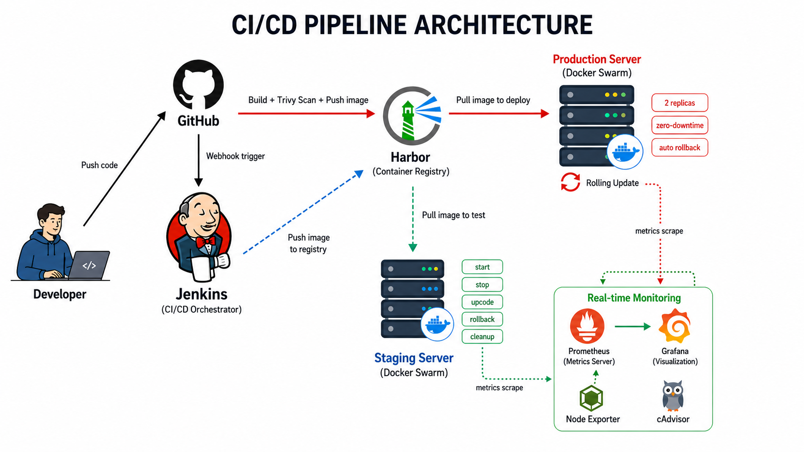

| Layer | Technologies | Project Highlights |
|---|---|---|
| **Application** | MERN Stack (MongoDB, Express, React, Node.js) | Separate frontend and backend services for easier scaling and maintenance. |
| **CI/CD Engine** | **Jenkins Pipeline (Groovy) + Webhooks** | Pipeline as Code, parameterized builds, and automated webhook triggers. |
| **Container Registry** | Harbor (self-hosted, private registry) | Versioned image tags and private image management. |
| **Orchestration** | Docker Swarm (multi-node cluster) | Start-first rolling updates, automatic failure rollback, and self-healing services. |
| **Security Scan** | Trivy (vulnerability scanner) | DevSecOps gate to block HIGH/CRITICAL vulnerabilities before deployment. |
| **Monitoring** | Prometheus, Grafana, Node Exporter, cAdvisor | Real-time host and container dashboards; alerting is documented as a future improvement. |
| **Infrastructure** | Google Cloud Platform (3 VMs) | Separate infrastructure roles for manager, worker, and registry/monitoring services. |

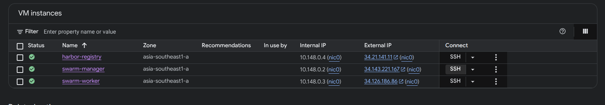

### 📁 Repository Layout

```text
.
├── Jenkinsfile.production.groovy       # Automated production pipeline script (8 stages)
├── Jenkinsfile.staging.groovy          # Flexible staging pipeline script (parameterized)
├── demo-troubleshooting-notes.md       # Practical troubleshooting notes for the cAdvisor issue
├── picture/                            # Architecture diagrams, pipeline screenshots, and dashboards
└── source/
    ├── backend/                        # Backend source code (Node.js) and multi-stage Dockerfile
    ├── frontend/                       # Frontend source code (React) and unprivileged Nginx Dockerfile
    ├── docker-compose.staging.yml      # Docker Swarm stack configuration for staging
    ├── docker-compose.production.yml   # Docker Swarm stack configuration for start-first production deployment
    ├── docker-compose.monitoring.yml   # Monitoring stack configuration (Prometheus, Grafana, cAdvisor)
    └── monitoring/                     # Static monitoring configuration (prometheus.yml, Grafana dashboards)
```

---

## 🛠️ Implementation Phases

The project is divided into four main phases that simulate a practical DevOps workflow, with **Jenkins acting as the main orchestration layer**.

---

### Phase 1: Containerizing the MERN Application & Setting Up the Repository

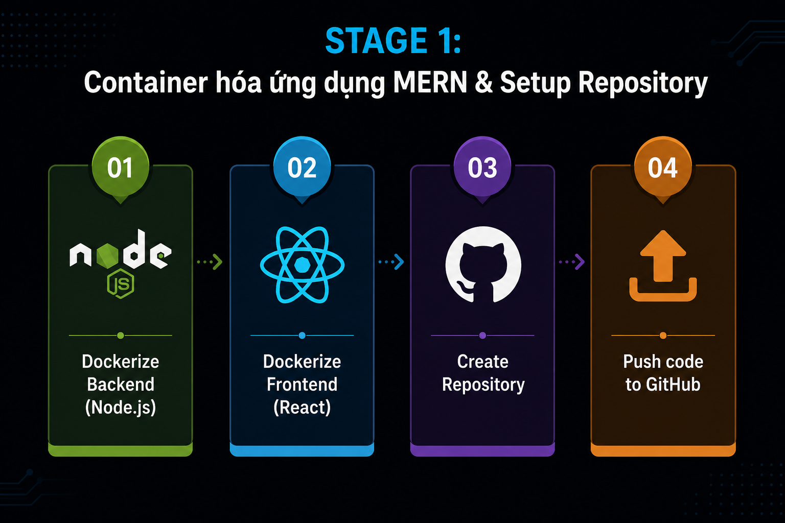

This phase focuses on packaging the MERN application into Docker containers. The Dockerfiles are designed to keep runtime images small, cache-friendly, and secure by using multi-stage builds and non-root users.

#### 1. Backend Dockerization (Node.js) — Security-focused Runtime

The backend image uses a multi-stage build to install dependencies separately. In the runtime stage, unnecessary tools such as `npm` and `npx` are removed to reduce the attack surface.

```dockerfile
# Stage 1: Install dependencies separately to take advantage of Docker layer caching
FROM node:22-alpine AS deps
WORKDIR /app
COPY package*.json ./
RUN npm ci --omit=dev

# Stage 2: Runtime - keep only what is required to run the app
FROM node:22-alpine AS runtime
# Upgrade OS packages, remove npm/npx from runtime, and create a non-root user
RUN apk upgrade --no-cache \
    && rm -rf /usr/local/lib/node_modules/npm /usr/local/bin/npm /usr/local/bin/npx \
    && addgroup -g 1001 -S appgroup \
    && adduser -u 1001 -S appuser -G appgroup
WORKDIR /app
COPY --from=deps --chown=appuser:appgroup /app/node_modules ./node_modules
COPY --chown=appuser:appgroup package*.json ./
COPY --chown=appuser:appgroup server.js entrypoint.sh ./
RUN chmod +x /app/entrypoint.sh

# Run the container as a non-root user (UID 1001)
USER appuser
EXPOSE 5000

HEALTHCHECK --interval=30s --timeout=3s --retries=3 \
  CMD wget -qO- http://127.0.0.1:5000/health || exit 1

# entrypoint.sh reads Docker Secrets from /run/secrets/backend_env and exports them as environment variables
ENTRYPOINT ["/app/entrypoint.sh"]
CMD ["node", "server.js"]
```

#### 2. Frontend Dockerization (React + Nginx) — Unprivileged Nginx

The React application is built into static HTML, JavaScript, and CSS assets, then served through an unprivileged Nginx image. This avoids using the default Nginx image, which normally requires root privileges to bind to port 80.

```dockerfile
# Stage 1: Build React app
FROM node:18-alpine AS build-stage
# BUILD_ENV controls which .env file is loaded (staging or production)
ARG BUILD_ENV=production
WORKDIR /app
COPY package*.json ./
RUN npm ci
COPY . .
RUN npm run build:${BUILD_ENV}

# Stage 2: Serve with unprivileged Nginx (non-root, port 8080)
FROM nginxinc/nginx-unprivileged:alpine AS production-stage
COPY --from=build-stage /app/build /usr/share/nginx/html
# Custom Nginx configuration for React SPA routing
COPY nginx.conf /etc/nginx/conf.d/default.conf
EXPOSE 8080
CMD ["nginx", "-g", "daemon off;"]
```

---

### Phase 2: Setting Up CI/CD Pipelines & Docker Swarm

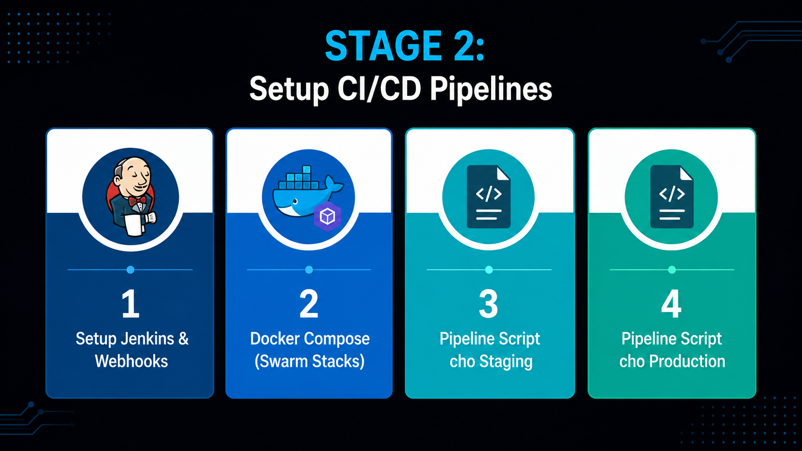

This phase establishes the infrastructure foundation: connecting Jenkins with Harbor credentials, creating Docker Swarm overlay networks, and defining Jenkins pipelines as code.

#### Technical Highlight: Start-first Rolling Deployment Configuration

The `docker-compose.production.yml` file uses two replicas and a start-first update strategy to minimize interruption during deployments. This is a resilience design choice; the project does not claim a formal availability SLA or load-tested zero-downtime guarantee.

```yaml
services:
  frontend:
    image: ${HARBOR_HOST}/mern/frontend:${IMAGE_TAG:-latest}
    ports:
      - "80:8080"
    deploy:
      replicas: 2
      update_config:
        parallelism: 1           # Update one container at a time
        delay: 10s               # Wait 10 seconds between updates
        order: start-first       # Start the new container before stopping the old one
        failure_action: rollback # Automatically roll back if the deployment fails
      placement:
        constraints:
          - node.labels.env == worker
```

---

### Phase 3: Deploying to Staging with Jenkins Parameters

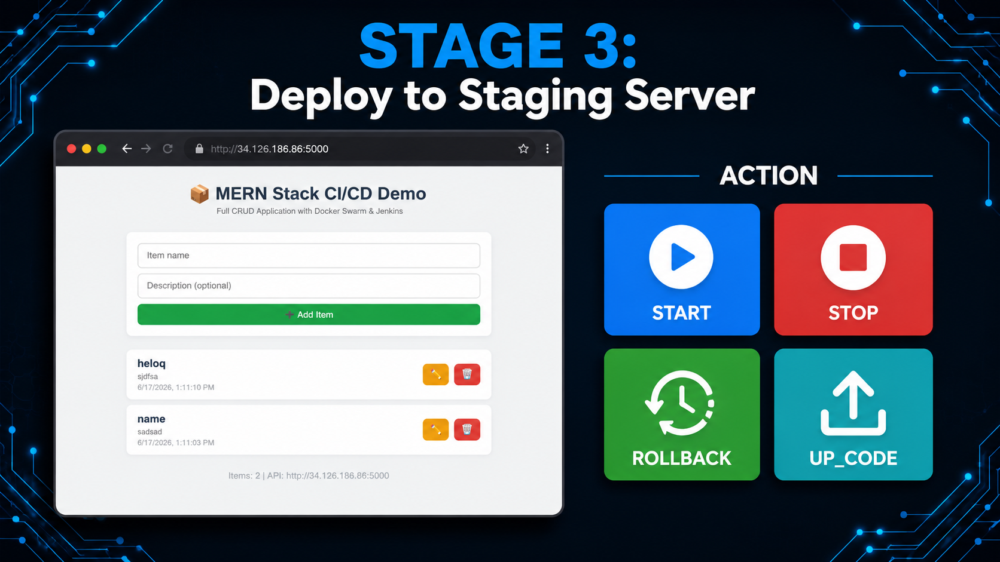

The staging environment is designed for QA and developer validation. Instead of being fully automatic, it provides controlled deployment options through **Jenkins Active Choices Plugin** and a parameterized pipeline.

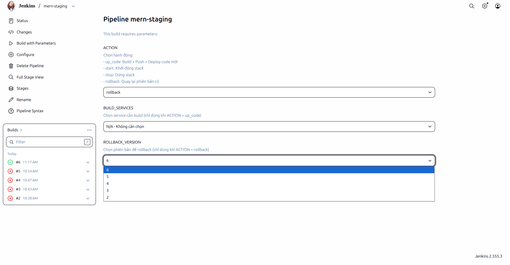

The pipeline provides a simple control interface for developers and QA:

- ▶️ **START**: Start the staging environment.
- ⏹️ **STOP**: Stop the staging environment when it is not in use.
- ⬆️ **UP_CODE (Selective Deploy)**: Build and deploy only the frontend or backend to reduce waiting time.
- ⏪ **ROLLBACK**: Roll back to a previous version selected from versioned images available on the Jenkins host, then run health checks against the restored services.

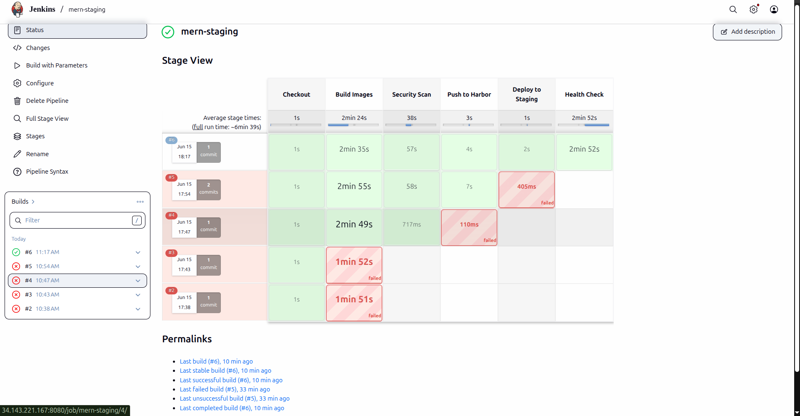

#### Jenkinsfile Excerpt: Handling Parameterized Logic with Groovy

The Jenkinsfile uses Groovy syntax with `try/catch` blocks to control deployment logic:

```groovy
// Smart deployment logic based on Jenkins parameters
stage('Deploy to Staging') {
    if (params.BUILD_SERVICES == 'all') {
        deployStack(COMPOSE_FILE, STACK_NAME, buildTag)
    } else if (params.BUILD_SERVICES == 'backend') {
        sh "docker service update --with-registry-auth --image ${backendImage}:${buildTag} ${STACK_NAME}_backend"
    }
}
```

---

### Phase 4: Deploying to Production & Monitoring

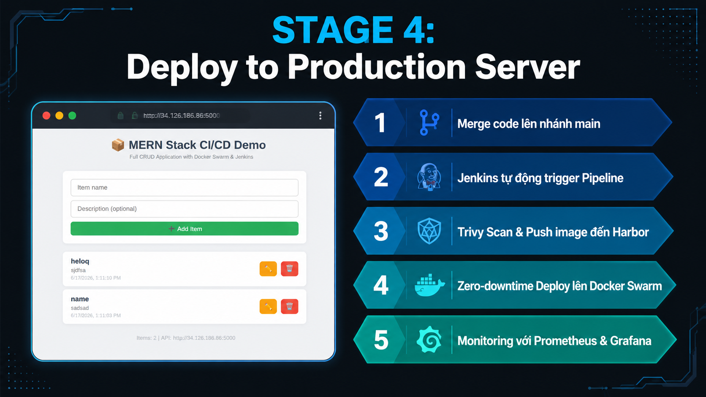

The production-like environment prioritizes stability and repeatability. The production pipeline is triggered by a GitHub webhook and runs through eight controlled stages before marking a deployment as successful.

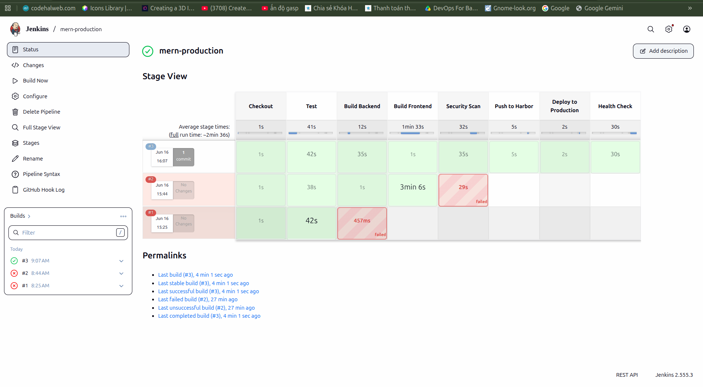

#### 1. Jenkins Production Pipeline — 8 Stages (~6.5 minutes)

1. **Checkout**: Pull the latest code from `main` through a GitHub webhook.
2. **Test**: Run unit tests using the configured Node.js tool in Jenkins.
3. **Build Backend**: Build the backend image and tag it with `${env.BUILD_NUMBER}`.
4. **Build Frontend**: Build the frontend image for the production environment with the same versioned tag.
5. **Security Scan (DevSecOps)**: Run Trivy scans. If HIGH/CRITICAL vulnerabilities are found, Jenkins fails the build and stops the deployment.
6. **Push to Harbor**: Use `withCredentials(...)` to authenticate safely and push approved images to Harbor.
7. **Deploy to Swarm**: Roll out the new version using the start-first Docker Swarm update strategy.
8. **Health Check**: Verify application health endpoints and require successful responses before marking the pipeline as successful.

#### 2. Monitoring

Prometheus and Grafana are used to collect and visualize host metrics through Node Exporter and container metrics through cAdvisor.

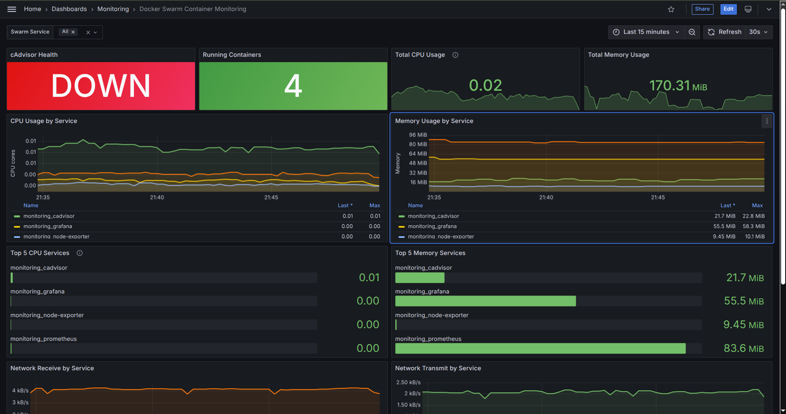
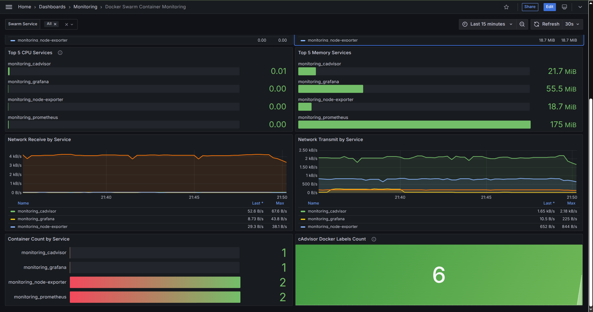

*The dashboards show resource usage per service and the number of running containers, making it easier to detect abnormal behavior such as memory leaks.*

#### 3. Planned Alerting Design (Not Yet Implemented)

The current repository provisions dashboards and metrics collection only. Prometheus alert rule files and Alertmanager are intentionally left as a future improvement. A production-oriented alerting design would include:

- 🔴 **cAdvisor Down**: Trigger when the metrics collector remains unavailable for a defined duration.
- 🟡 **Docker Labels Missing**: Detect when cAdvisor is reachable but Docker Swarm service labels disappear.
- 🟠 **High CPU/Memory Usage**: Trigger only after sustained utilization above a chosen threshold to avoid noisy alerts.

The implementation would add Prometheus `rule_files`, version-controlled rule definitions, Alertmanager routing, and a tested notification receiver. These items are not presented as completed features in this project.

---

## 🔧 Troubleshooting & Debugging

DevOps work also requires diagnosing and resolving infrastructure issues. This project includes a real troubleshooting case related to cAdvisor and Docker Engine compatibility.

**Issue:** Docker Swarm container metadata disappeared from Grafana dashboards.

- **Root cause:** Docker Engine 29 changed the internal `layerdb` storage structure expected by cAdvisor. The Docker container handler could not initialize correctly, leaving only root cgroup metrics and removing the Swarm labels required by the dashboard queries.
- **Resolution:** Instead of downgrading Docker, I investigated the issue and implemented a **Shell script combined with a Linux cron job**. The script creates dummy `mount-id` files every minute to restore the expected structure for cAdvisor, allowing it to collect container metrics and labels again.

Detailed analysis is available in [demo-troubleshooting-notes.md](demo-troubleshooting-notes.md).

---

## 🏆 What This Project Demonstrates

1. **Jenkins Pipeline Experience:** Building Jenkins Pipeline-as-Code with Groovy, parameterized builds using Active Choices Plugin, and automated webhook-based production deployments.
2. **Production-ready Deployment Thinking:** Designing rolling updates, automatic rollback behavior, service health checks, and resource limits for containers.
3. **DevSecOps Practices:** Integrating Trivy vulnerability scanning into the pipeline, using non-root containers, Docker Secrets, and network isolation.
4. **Practical Debugging Ability:** Diagnosing compatibility issues such as cAdvisor with Docker Engine 29+ and implementing a working fix with shell scripting and cron.
5. **Cloud Cost Awareness:** Designing the staging pipeline with selective deployment and cleanup options to reduce unnecessary cloud resource usage.
